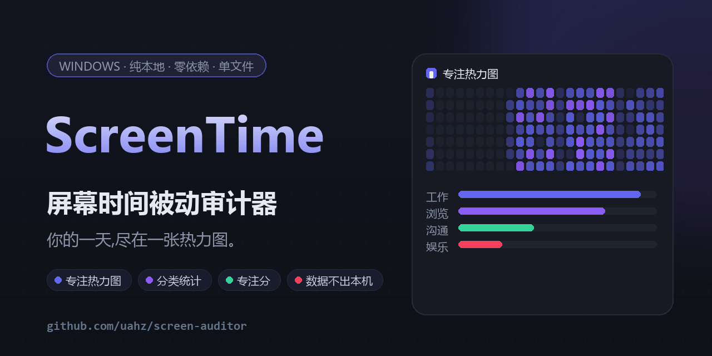

<div align="center">



# ⏱️ ScreenTime · 屏幕时间被动审计器

*后台静默记录焦点窗口,生成分应用耗时、分类汇总、专注热力图、切换分析的本地审计报告。*
*纯本地 · 零依赖 · 单文件即可运行 —— 看懂自己的时间都去哪儿了。*

[](../../releases/latest)
[](LICENSE)
[](#)
[](#)
[](#)
[](../../actions/workflows/ci.yml)

**🚀 [下载 exe](../../releases/latest)** &nbsp;|&nbsp; 🐍 **[用源码跑](#-快速上手)** &nbsp;|&nbsp; 🧠 **[工作原理](#-它是怎么工作的)**

</div>

---

## ✨ 它能给你什么

> 每天看手机屏幕使用时间的人,却对自己在电脑上花了 10 小时毫无概念 —— 这个工具就是补上这块拼图。

| | 特性 | 说明 |
|---|---|---|
| 🔥 | **专注热力图** | 7 天 × 24 小时的专注强度矩阵,你是上午型还是深夜型,一张图现形 |
| 🧩 | **分类汇总** | 工作 / 浏览 / 沟通 / 娱乐……自定义映射,环形图 + 每日构成一眼定性强弱 |
| 🎯 | **专注分** | 时长达成 60% + 单段深度 40%,0-100 分给自己的专注力打分 |
| 📈 | **周对比** | 与上一周期同比:专注 ▲、摸鱼 ▼,进步看得见 |
| 🪟 | **托盘 + 浮窗** | 常驻托盘图标,右下角置顶浮窗实时显示"今日专注",随时一键看报告 |
| 💤 | **离开检测** | 2 分钟无键鼠输入自动判为离开,接水摸鱼不背锅 |
| 🔒 | **绝对本地** | 无账号、无网络请求、无遥测;数据是 SQLite 文件,随时可删 |
| 🪶 | **零依赖单文件** | 标准库实现,无需 `pip install`;exe 版双击即用 |

## 🖥️ 报告长什么样

自包含的单文件 HTML(暗色主题),无任何外部资源,**离线可开、随手转发**:

<div align="center">

<br/>
&nbsp;&nbsp;
</div>

> 报告页与横幅中的数据均为脚本生成的演示数据,你的真实数据永远只留在本机。

## 🚀 快速上手

**方式一:下载 exe(推荐,免装 Python)**

到 [Releases](../../releases/latest) 下载 `screentime.exe`,然后:

```bat
screentime start       :: 后台开始记录
screentime tray        :: 挂上托盘图标 + 今日专注浮窗(可选)
screentime today       :: 随时看看今天用了哪些应用
screentime report      :: 生成报告并自动打开浏览器
screentime install     :: 注册开机自启(可选)
screentime stop        :: 停止记录
```

**方式二:源码运行**

```bat
git clone https://github.com/uahz/screen-auditor.git
cd screen-auditor
python screentime.py start
python screentime.py report --days 7
```

其他命令:`status` 查看状态与最后一条记录、`export --days 30` 导出会话 CSV、
`--version` 看版本。

## 🧠 它是怎么工作的

```
 user32!GetForegroundWindow ──► 每 3s 采样 (进程名, 窗口标题)
        │                        内容不变不落库,60s 心跳保活
        ▼
 SQLite append-only 样本表 ◄── GetLastInputInfo 空闲判定(120s 阈值)
        │                        config.ini / ignore.json 可调可过滤
        ▼
 会话重构:相邻心跳合并,跨度封顶 180s
 按天 / 小时边界精确切分,跨界时长各归各的桶
        │
        ▼
 聚合渲染 ──► reports/report.html(纯内联 CSS/SVG,零外部请求)
```

- `tracker.py` — 采样器:ctypes 直调 Win32 API,内存占用约等于一个记事本
- `db.py` — 存储层:append-only + WAL,进程被强杀也不丢历史
- `report.py` — 报表:会话重构、跨界切分、分类/对比/评分、HTML 渲染
- `tray.py` — 托盘与浮窗:纯 ctypes 手写 Shell_NotifyIcon + GDI 绘制
- `scripts/seed_demo.py` — 演示数据种子(README 截图即由它生成)

## ⚙️ 配置文件(首次运行自动生成)

| 文件 | 作用 |
| --- | --- |
| `data\config.ini` | 采样间隔 / 心跳 / 空闲阈值 |
| `data\ignore.json` | 忽略名单:命中进程名或标题正则的窗口完全不记录 |
| `data\categories.json` | 应用 → 分类映射,改完重新生成报告即生效 |

数据目录默认在 exe / 源码目录旁;若放在只读位置会自动退回 `%LOCALAPPDATA%\ScreenTime`。

## ⚠️ 已知限制

- **纯阅读会被记为"离开"**:空闲判定基于键鼠输入,看长文档 / 开会听讲不产生输入。
  报告页脚已标注此口径。
- **管理员窗口读不到标题**:以提权运行的程序因 UIPI 隔离只记进程名,不记标题。
- **Win11 托盘图标默认折叠**:新图标先收进 `^` 溢出区,想常驻可在任务栏设置里拖出来。

## 🗺️ Roadmap

- [ ] 浏览器域名级细分(UI Automation 读地址栏)
- [ ] 主动提醒模式("B 站超过 30 分钟弹窗提醒我")
- [ ] 每周日晚定时生成周报并弹出总结
- [ ] 英文界面

## 🛠️ 开发

```bat
python -m pytest tests -q                 :: 15 项聚合层单元测试
python scripts/seed_demo.py 15            :: 生成演示数据(会覆盖 data 库!)
python scripts/make_assets.py             :: 重新生成图标与横幅(需 Pillow)
python -m PyInstaller --onefile --icon assets/icon.ico --add-data "assets;assets" screentime.py
```

推送 `v*` 标签后,CI 会自动跑测试、打包 exe 并发布 Release(见 `.github/workflows/`)。
`pytest` / `Pillow` / `PyInstaller` 均为开发期依赖,运行时零依赖的承诺不变。

## 📄 License

[MIT](LICENSE) © 2026 uahz

---

<div align="center">
<sub>如果它帮你找回了对时间的感知,欢迎点个 ⭐</sub>
</div>
