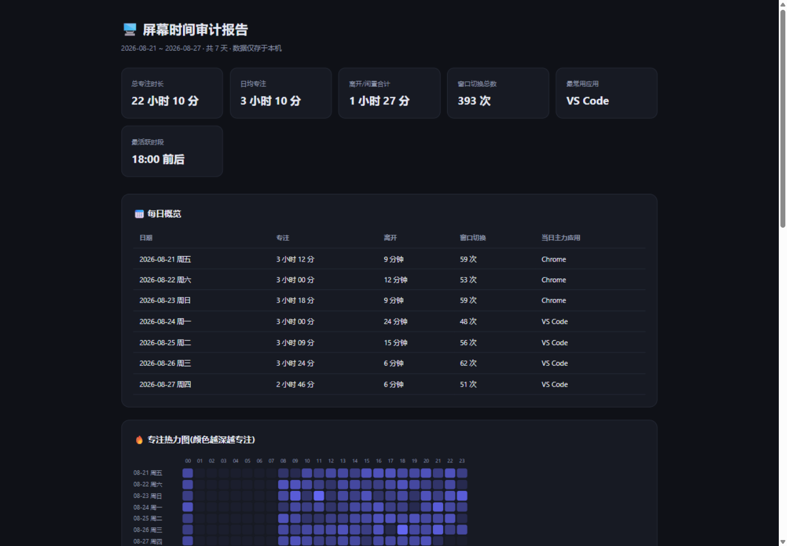
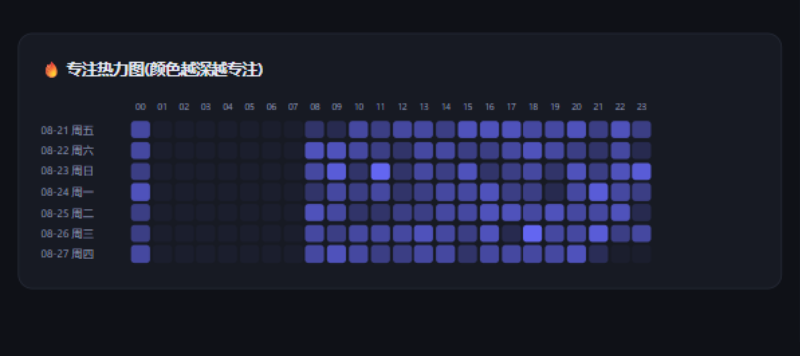
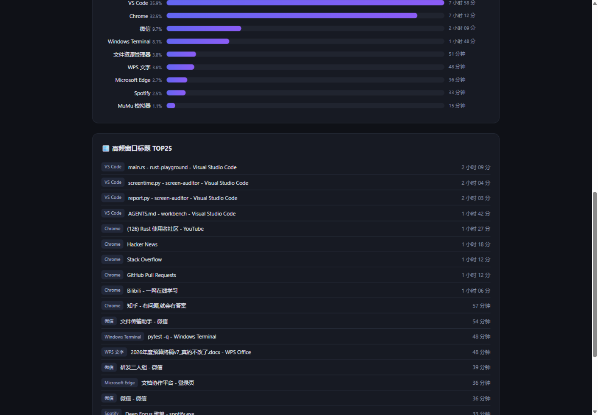

<div align="center">

# ⏱️ ScreenTime · 屏幕时间被动审计器

**你的一天,尽在一张热力图。**

*后台静默记录焦点窗口,生成分应用耗时、专注热力图、切换分析的本地审计报告。*
*纯本地 · 零依赖 · 单文件即可运行 —— 看懂自己的时间都去哪儿了。*

[](../../releases/latest)
[](LICENSE)
[](#)
[](#)
[](#)



<br/>

&nbsp;&nbsp;

<br/>

📦 **[下载 exe 直接用](../../releases/latest)** &nbsp;|&nbsp; 🐍 **[用源码跑](#-快速上手)** &nbsp;|&nbsp; 🧠 **[工作原理](#-它是怎么工作的)**

</div>

---

## ✨ 它能给你什么

> 每天看手机屏幕使用时间的人,却对自己在电脑上花了 10 小时毫无概念 —— 这个工具就是补上这块拼图。

| | 特性 | 说明 |
|---|---|---|
| 🔥 | **专注热力图** | 7 天 × 24 小时的专注强度矩阵,你是上午型还是深夜型,一张图现形 |
| 📊 | **应用耗时排行** | 谁偷走了你的时间?VS Code、Chrome 还是 B 站,按占比排排坐 |
| 🔀 | **窗口切换分析** | 每天 393 次窗口切换 = 至少 40 分钟的注意力税,数字会说话 |
| 💤 | **离开检测** | 2 分钟无键鼠输入自动判为离开,接水摸鱼不背锅 |
| 🔒 | **绝对本地** | 无账号、无网络请求、无遥测;数据是 SQLite 文件,随时可删 |
| 🪶 | **零依赖单文件** | 标准库实现,无需 `pip install`;exe 版双击即用 |

## 🖥️ 报告里有什么

自包含的单文件 HTML(暗色主题),无任何外部资源,**离线可开、随手转发**:

- **指标卡片**:总专注 / 日均专注 / 离开合计 / 切换总数 / 最常用应用 / 最活跃时段
- **每日概览表**:每天的专注、离开、切换次数与当日主力应用
- **🔥 专注热力图**:颜色越深越投入,你的生物钟一目了然
- **应用排行**:带占比的渐变条形图
- **高频窗口标题 TOP25**:具体到每一个文档、每一首歌

## 🚀 快速上手

**方式一:下载 exe(推荐,免装 Python)**

到 [Releases](../../releases/latest) 下载 `screentime.exe`,然后:

```bat
screentime.exe start      :: 后台开始记录
screentime.exe today      :: 随时看看今天用了哪些应用
screentime.exe report     :: 生成报告并自动打开浏览器
screentime.exe stop       :: 停止记录
```

**方式二:源码运行**

```bat
git clone https://github.com/uahz/screen-auditor.git
cd screen-auditor
python screentime.py start
python screentime.py report --days 7
```

其他命令:`status` 查看状态与最后一条记录、`run` 前台调试、`today --top 20` 自定义榜单。

## 🧠 它是怎么工作的

```
 user32!GetForegroundWindow ──► 每 3s 采样 (进程名, 窗口标题)
        │                        内容不变不落库,60s 心跳保活
        ▼
 SQLite append-only 样本表 ◄── GetLastInputInfo 空闲判定(120s 阈值)
        │
        ▼
 报告期还原:样本有效期延续至下一条(封顶 180s)
 关机 / 休眠的时间空洞不会被计成专注
        │
        ▼
 聚合渲染 ──► reports/report.html(纯内联 CSS,零外部请求)
```

- `tracker.py` — 采样器:ctypes 直调 Win32 API,内存占用约等于一个记事本
- `db.py` — 存储层:append-only 设计,进程被强杀也不丢历史
- `report.py` — 报表:跨日聚合、热力图着色、HTML 渲染
- `scripts/seed_demo.py` — 演示数据种子脚本(本页截图即由它生成)

## 🔐 数据与隐私

| 路径 | 内容 | 备注 |
| --- | --- | --- |
| `data\screen_time.db` | 原始样本(SQLite) | 整个文件夹删掉 = 一切归零 |
| `reports\report.html` | 生成的报告 | 只在你机器上 |

仓库本身**不含任何真实使用数据**,`data/` 与 `reports/` 已被 `.gitignore` 排除。

## 🗺️ Roadmap

- [ ] 开机自启(schtasks 计划任务一条命令)
- [ ] 敏感标题脱敏规则(命中关键词的窗口不入库)
- [ ] 浏览器域名级细分(UI Automation 读地址栏)
- [ ] 每周日晚定时生成周报并弹出总结

## 📄 License

[MIT](LICENSE) © 2026 uahz

---

<div align="center">
<sub>如果它帮你找回了对时间的感知,欢迎点个 ⭐</sub>
</div>
